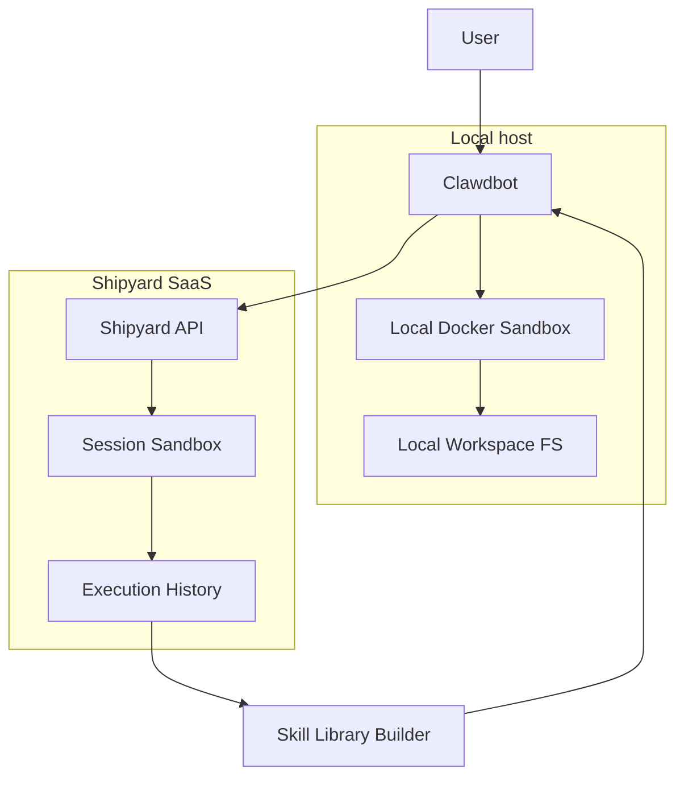

# Shipyard 集成可行性与差距分析报告

## 1. 概述 (Overview)

经过深入分析，我们认为 **Shipyard** 是 `clawdbot` 实现“远程/隔离”执行引擎（Remote/Isolated Execution Engine）的强力候选方案。

目前的 `clawdbot` 执行环境主要依赖本地 Docker 容器。引入 Shipyard 将带来以下核心优势：
*   **Python 执行能力的飞跃**：从无状态的脚本执行升级为支持持久化状态的 IPython 环境。
*   **Agent 技能演进的基础**：Shipyard 的执行历史（Execution History）功能为 Agent 的自我学习和技能复用提供了数据基础。
*   **环境隔离**：为高风险操作或纯计算任务提供了更安全的隔离环境。

## 2. 可替换模块 (Replaceable Modules)

集成 Shipyard 后，`clawdbot` 的部分核心模块可以被替换或升级，从而简化架构并提升能力：

### 2.1 容器生命周期 (Container Lifecycle)
*   **现状**：`src/agents/sandbox/docker.ts` 包含大量手动管理 Docker 容器生命周期（启动、停止、清理）的代码，维护成本较高。
*   **未来**：Shipyard 的 **Bay 服务** 可以完全接管容器管理。我们只需调用 API 请求环境，无需关心底层的 Docker CLI 调用。

### 2.2 Shell 执行 (Shell Execution)
*   **现状**：`src/agents/bash-tools.exec.ts` 通过 `docker exec` 执行 Shell 命令。
*   **未来**：可以直接使用 Shipyard 的 `sandbox.shell.exec()` API。这不仅简化了调用方式，还统一了执行接口。

### 2.3 Python 环境 (Python Environment)
*   **现状**：目前的 Python 执行是无状态的（Stateless）。每次运行 `python script.py` 都是一个新的进程，变量无法在多次执行间共享。
*   **未来**：Shipyard 原生支持 **IPython**。这意味着 Agent 可以像使用 Jupyter Notebook 一样，分步执行代码，保留变量状态。这对于数据分析、调试和复杂逻辑构建是质的飞跃。

## 3. 关键缺失与风险 (Critical Deficiencies)

尽管 Shipyard 优势明显，但在完全替代现有本地 Docker 方案之前，必须解决以下关键技术差距：

### 3.1 本地文件系统访问 (Local File System Access / Bind Mounts)
*   **严重程度**：🔴 **高 (Critical)**
*   **问题描述**：`clawdbot` 的核心用例之一是直接修改用户的本地项目文件。目前通过 Docker 的 Bind Mounts (`-v host_path:container_path`) 实现，Agent 的修改即时反映在宿主机上。
*   **Shipyard 现状**：Shipyard 的设计理念倾向于隔离存储（Isolated Storage）。如果不支持将宿主机目录直接挂载到沙箱中，Agent 将无法直接编辑本地文件。
*   **影响**：如果必须通过上传/下载 API 来同步文件，将导致严重的性能损耗，并破坏“实时编辑”的用户体验。

### 3.2 交互式 TTY (Interactive TTY)
*   **严重程度**：🟠 **中 (Medium)**
*   **问题描述**：`clawdbot` 支持 `vim`、`top` 等交互式命令行工具，这依赖于 PTY (Pseudo-Terminal) 的实时流式传输。
*   **Shipyard 现状**：Shipyard 的 HTTP API 目前主要针对非交互式执行。如果缺乏 WebSocket 或类似的流式传输支持，将无法支持交互式工具。

### 3.3 沙箱浏览器 (Sandbox Browser)
*   **严重程度**：🟠 **中 (Medium)**
*   **问题描述**：`clawdbot` 使用一个 Sidecar 容器 (`clawdbot-sandbox-browser`) 来提供安全的网页浏览能力（Headless Chrome）。
*   **Shipyard 现状**：Shipyard 采用 "1:1 Session-Ship" 模型。我们需要验证该模型是否支持 Sidecar 模式，或者是否允许在同一个 Pod/环境内运行多个服务，以维持现有的浏览器沙箱架构。

## 4. 演进建议 (Recommendations)

鉴于上述差距，特别是本地文件系统访问的问题，建议采取 **双引擎策略 (Dual Engine Strategy)** 进行渐进式演进：

### 4.1 总体策略：双引擎并存
不要立即废弃现有的本地 Docker 实现。将 Shipyard 作为一种新的、互补的执行提供者（Execution Provider）引入。

**核心理由**：除了功能上的缺失（如 Bind Mounts），**非功能性约束**也是维持双引擎的关键因素：
*   **性能体验**：本地 Docker 的 Unix Socket 通信几乎无延迟，而远程 HTTP 交互在处理高频小命令（如 `ls`, `git status` 循环）时会有显著的累积延迟。
*   **数据效率**：本地编辑涉及大量文件读写，Bind Mounts 提供了零拷贝的高效访问，而远程方案的大文件传输会严重拖慢工作流。

### 4.2 阶段规划

#### 阶段 1: 引入 Shipyard (Phase 1)
*   **目标**：建立 `ShipyardExecutionProvider`，用于处理不需要本地文件访问的任务。
*   **适用场景**：
    *   纯代码生成与验证（Code Generation）。
    *   数据分析与处理（Data Analysis）。
    *   高风险操作的沙箱测试（Dangerous Operations）。
*   **价值**：利用 Shipyard 的持久化 Python 环境和隔离性，增强 Agent 在特定领域的处理能力。

#### 阶段 2: 保持本地能力 (Phase 2)
*   **目标**：维持现有工作流的稳定性。
*   **行动**：继续使用 `src/agents/sandbox/docker.ts` 处理涉及本地项目文件编辑的任务（如代码重构、功能开发）。
*   **优化**：可以在此阶段优化现有 Docker 实现的稳定性，但暂不进行架构迁移。

#### 阶段 3: 统一引擎 (Phase 3 - 长期目标)
*   **目标**：解决关键技术差距，最终实现执行引擎的统一。
*   **行动**：
    *   **研发 Bind Mount 支持**：探索在 Shipyard 中实现本地目录挂载的可行性，或开发高性能的双向文件同步机制（类似 Mutagen）。
    *   **解决 TTY/Sidecar 问题**：与 Shipyard 团队合作或自行扩展，支持交互式流和多容器编排。
    *   **迁移**：当 Shipyard 能够完全覆盖本地开发场景后，逐步废弃旧的 Docker 实现。

## 5. 纯网络接口的局限性分析 (Limitations of Pure Network Interface)

虽然 Shipyard 提供了强大的远程执行能力，但将其作为本地执行引擎的替代品时，必须正视纯网络接口（HTTP API）相对于本地 Docker 执行模型（Local Execution）的局限性。

### 5.1 延迟与性能 (Latency & Performance)
*   **HTTP 开销**：本地 Docker 执行（通过 Unix Socket）几乎是瞬时的。而 Shipyard 的每次操作都需要经过 HTTP 请求/响应周期（建立连接、TLS 握手、序列化/反序列化）。对于高频、短时的命令（如 `ls`, `git status`），这种累积延迟会显著降低 Agent 的响应速度。
*   **流式输出**：本地执行可以轻松实现 stdout/stderr 的实时流式传输。虽然 HTTP 支持 Chunked Transfer Encoding 或 WebSocket，但在网络不稳定的情况下，流式输出可能会出现卡顿或乱序，影响用户体验。

### 5.2 状态管理 (State Management)
*   **Shell 会话持久性**：
    *   **本地**：通常维护一个持久的 Shell 进程（如 `bash`），环境变量和工作目录（CWD）在命令之间自然保持。
    *   **网络 API**：HTTP 请求本质上是无状态的。要在 Shipyard 中模拟持久会话，客户端必须显式管理状态（如在每次请求中传递 CWD 和 ENV），或者依赖 Shipyard 提供的有状态 Session 抽象。如果 Session 因网络问题中断，恢复状态将变得复杂。

### 5.3 数据传输效率 (Data Transfer Efficiency)
*   **大文件处理**：
    *   **本地**：通过 Bind Mounts，容器直接访问宿主机文件系统，读写大文件（如日志、数据库转储、构建产物）是零拷贝的，速度仅受磁盘 I/O 限制。
    *   **网络 API**：必须通过网络上传/下载文件。对于 GB 级别的文件，这不仅耗时，还会占用大量带宽，甚至可能触发 HTTP 请求体大小限制或超时。
*   **命令输出**：如果某个命令产生了大量文本输出（如详细的构建日志），通过 HTTP 传输这些数据可能会导致内存激增或传输中断。

### 5.4 安全性考量 (Security Implications)
*   **攻击面扩大**：本地 Docker 仅监听 Unix Socket，权限控制由文件系统权限决定。将执行接口暴露为 HTTP API（即使是本地监听），理论上增加了被其他恶意进程扫描或利用的风险。
*   **认证复杂性**：必须实施严格的 API 认证机制（如 Token 或 mTLS），防止未授权访问。这比单纯的本地 Socket 权限管理更复杂。

### 5.5 客户端复杂性 (Client Complexity)
*   **错误处理**：客户端（clawdbot）必须处理各种网络相关的错误场景（超时、连接重置、DNS 解析失败），而这些在本地执行中几乎不存在。
*   **重连逻辑**：如果网络波动导致请求失败，客户端需要实现智能的重试和重连逻辑，同时要确保操作的幂等性（Idempotency），避免重复执行破坏性命令。

## 6. 安全与架构分离的考量 (Security & Architecture Separation)

针对用户关于“如果 Shipyard 与 Bot 分离部署，如何保证本地文件安全？”的关切，我们需要明确区分两种架构模式的安全边界。

### 6.1 本地 Docker 模式的安全假设 (Current Local Model)
*   **信任模型**：在当前的 `clawdbot` 架构中，Agent 运行在用户的本地机器上（Localhost）。用户启动 Agent，即代表授权 Agent 代表用户操作本机。
*   **文件访问**：Docker 容器通过 Bind Mounts 直接挂载用户指定的本地目录。这种访问是安全的，因为控制权完全在用户手中，且数据从未离开本地网络。

### 6.2 远程 Shipyard 的分离风险 (Risks of Remote Separation)
如果我们将 Shipyard 部署在远程服务器（如云端集群），而 Bot 仍然需要操作用户的本地文件，就会产生严重的安全隐患：
*   **攻击面暴露**：为了让远程 Shipyard 访问本地文件，必须建立反向隧道（Reverse Tunnel）或将本地文件系统暴露到公网。这相当于给本地机器开了一个后门。
*   **信任崩塌**：一旦远程 Shipyard 实例被攻破，攻击者将获得对用户本地文件系统的读写权限。这是不可接受的架构风险。
*   **结论**：**绝对不推荐**在“远程 Shipyard + 本地文件挂载”的模式下运行。远程环境应严格限制在隔离的沙箱内，不应触碰任何本地敏感数据。

### 6.3 双引擎策略的防御机制 (Dual Engine Mitigation)
为了兼顾能力扩展与安全性，我们提出的“双引擎策略”是最佳解法：

1.  **本地引擎 (Local Engine)**：
    *   **职责**：处理所有涉及本地文件系统（Local FS）的任务，如代码重构、本地构建、文件管理。
    *   **技术**：继续使用现有的本地 Docker 方案。
    *   **安全**：数据不出本地，零外部风险。

2.  **远程引擎 (Remote Engine - Shipyard)**：
    *   **职责**：处理隔离的、计算密集型的、或需要持久化环境的任务（如数据分析、Python 代码生成）。
    *   **技术**：连接到远程 Shipyard 实例。
    *   **安全**：**严格隔离**。远程引擎**不挂载**任何本地目录。输入数据通过 API 显式传输，输出结果通过 API 返回。即使远程环境失陷，攻击者也无法触及用户的本地环境。

通过这种分离，我们确保了：**本地的归本地（安全），远程的归远程（隔离）。**

## 7. Shipyard SaaS 定位与边界 (SaaS Positioning & Boundaries)

在 “Shipyard 作为 SaaS，且与 Clawdbot 不同机部署” 的前提下，我们需要明确：**Shipyard 不应被定位为本地 Docker 的 1:1 替代品（remote docker replacement）**，而应被定位为：

- **远程隔离执行与可学习记忆后端 (Remote Sandbox Compute + Learnable Memory Backend)**

### 7.1 核心定位

- Shipyard SaaS：提供隔离执行（Python/Shell）、环境规格（Spec）、会话生命周期（Session/TTL/Warm Pool）、以及可检索/可标注的执行历史（Execution History）。
- Clawdbot 本地：继续负责所有必须触碰用户本机权限与工作区文件系统的能力（本地文件读写、本地构建、Git 操作、TTY 交互体验、浏览器 Sidecar 等）。

换句话说：**执行与学习可以远程化，但“改本地代码”不能远程化。**

### 7.2 推荐的双引擎架构

### 7.3 能力边界表（必须做 / 可以做 / 明确不做）

| 类别 | Shipyard SaaS | Clawdbot 本地 |
|---|---|---|
| 隔离计算执行 | ✅ 必须做（python/shell，session-first） | ✅ 可做（本地 docker exec） |
| 执行历史与技能元数据 | ✅ 必须做（`execution_id`、`tags/notes/description`、精确查询/标注/过滤） | ✅ 可选做（本地执行结果上报到 Shipyard） |
| 本地文件系统直接读写 | ❌ 明确不做（SaaS 不应触碰用户本机 FS） | ✅ 必须做（bind-mount/直接编辑） |
| TTY/交互式 shell | ⚠️ 可选（有价值但不是 SaaS 核心） | ✅ 必须做（保持现有体验） |
| 浏览器 Sidecar / 多容器编排 | ⚠️ 可选（取决于产品方向） | ✅ 现状已有（sandbox browser） |
| 工件输入输出（artifact） | ✅ 可以做（上传输入/下载输出，带白名单与配额） | ✅ 可以做（本地生成 patch/apply patch） |

### 7.4 为什么 SaaS 不做“本地目录挂载”

- **安全边界**：让远程服务访问本地目录，等同于引入反向隧道/后门，一旦远程被攻破，将直接危及用户本机数据。
- **产品复杂度**：同步/冲突/权限/审计/断点续传会把 Shipyard 变成“远程文件系统”产品，偏离核心价值。
- **体验不可控**：对大型仓库与高频读写场景，网络同步很难稳定达到 bind-mount 的体验。

结论：对 SaaS 形态而言，**Shipyard 应坚持隔离计算 + 学习记忆**，通过双引擎与显式数据传输（artifact/patch）完成闭环。

