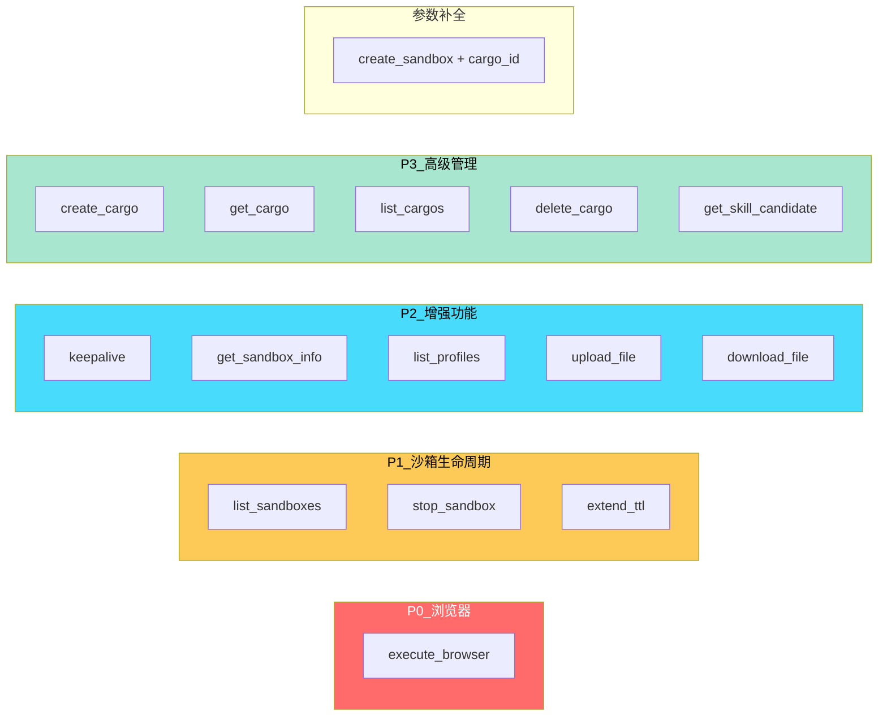

# MCP vs SDK 功能差距分析

> 对比 `shipyard-neo-mcp` 已暴露的 MCP tools 与 `shipyard-neo-sdk` 已实现的 API，
> 找出 MCP 层缺失的功能。

## 分析结论

### MCP 已实现的 18 个工具

| # | MCP Tool | 对应 SDK 方法 | 状态 |
|---|----------|--------------|------|
| 1 | `create_sandbox` | [`BayClient.create_sandbox()`](../shipyard-neo-sdk/shipyard_neo/client.py:123) | ✅ 已实现 |
| 2 | `delete_sandbox` | [`Sandbox.delete()`](../shipyard-neo-sdk/shipyard_neo/sandbox.py:112) | ✅ 已实现 |
| 3 | `execute_python` | [`PythonCapability.exec()`](../shipyard-neo-sdk/shipyard_neo/capabilities/python.py:16) | ✅ 已实现 |
| 4 | `execute_shell` | [`ShellCapability.exec()`](../shipyard-neo-sdk/shipyard_neo/capabilities/shell.py:15) | ✅ 已实现 |
| 5 | `read_file` | [`FilesystemCapability.read_file()`](../shipyard-neo-sdk/shipyard_neo/capabilities/filesystem.py:16) | ✅ 已实现 |
| 6 | `write_file` | [`FilesystemCapability.write_file()`](../shipyard-neo-sdk/shipyard_neo/capabilities/filesystem.py:35) | ✅ 已实现 |
| 7 | `list_files` | [`FilesystemCapability.list_dir()`](../shipyard-neo-sdk/shipyard_neo/capabilities/filesystem.py:52) | ✅ 已实现 |
| 8 | `delete_file` | [`FilesystemCapability.delete()`](../shipyard-neo-sdk/shipyard_neo/capabilities/filesystem.py:72) | ✅ 已实现 |
| 9 | `get_execution_history` | [`Sandbox.get_execution_history()`](../shipyard-neo-sdk/shipyard_neo/sandbox.py:153) | ✅ 已实现 |
| 10 | `get_execution` | [`Sandbox.get_execution()`](../shipyard-neo-sdk/shipyard_neo/sandbox.py:179) | ✅ 已实现 |
| 11 | `get_last_execution` | [`Sandbox.get_last_execution()`](../shipyard-neo-sdk/shipyard_neo/sandbox.py:186) | ✅ 已实现 |
| 12 | `annotate_execution` | [`Sandbox.annotate_execution()`](../shipyard-neo-sdk/shipyard_neo/sandbox.py:194) | ✅ 已实现 |
| 13 | `create_skill_candidate` | [`SkillManager.create_candidate()`](../shipyard-neo-sdk/shipyard_neo/skills.py:22) | ✅ 已实现 |
| 14 | `evaluate_skill_candidate` | [`SkillManager.evaluate_candidate()`](../shipyard-neo-sdk/shipyard_neo/skills.py:65) | ✅ 已实现 |
| 15 | `promote_skill_candidate` | [`SkillManager.promote_candidate()`](../shipyard-neo-sdk/shipyard_neo/skills.py:85) | ✅ 已实现 |
| 16 | `list_skill_candidates` | [`SkillManager.list_candidates()`](../shipyard-neo-sdk/shipyard_neo/skills.py:41) | ✅ 已实现 |
| 17 | `list_skill_releases` | [`SkillManager.list_releases()`](../shipyard-neo-sdk/shipyard_neo/skills.py:98) | ✅ 已实现 |
| 18 | `rollback_skill_release` | [`SkillManager.rollback_release()`](../shipyard-neo-sdk/shipyard_neo/skills.py:120) | ✅ 已实现 |

### MCP 缺失的功能（SDK 有但 MCP 没暴露）

| # | 缺失功能 | SDK 方法 | 优先级 | 说明 |
|---|---------|----------|-------|------|
| **A1** | 🔴 浏览器执行 | [`BrowserCapability.exec()`](../shipyard-neo-sdk/shipyard_neo/capabilities/browser.py:15) | **P0** | 设计文档已规划，阶段 1.1 |
| **A2** | 🟡 Sandbox 列表 | [`BayClient.list_sandboxes()`](../shipyard-neo-sdk/shipyard_neo/client.py:172) | P1 | 列出沙箱，便于管理 |
| **A3** | 🟡 Sandbox 停止 | [`Sandbox.stop()`](../shipyard-neo-sdk/shipyard_neo/sandbox.py:103) | P1 | 停止会话但保留数据 |
| **A4** | 🟡 Sandbox TTL 延期 | [`Sandbox.extend_ttl()`](../shipyard-neo-sdk/shipyard_neo/sandbox.py:120) | P1 | 长任务场景必须 |
| **A5** | 🟡 Sandbox 保活 | [`Sandbox.keepalive()`](../shipyard-neo-sdk/shipyard_neo/sandbox.py:143) | P2 | 延长 idle timeout |
| **A6** | 🟡 Sandbox 刷新 | [`Sandbox.refresh()`](../shipyard-neo-sdk/shipyard_neo/sandbox.py:95) | P2 | 获取最新状态 |
| **A7** | 🟡 Profile 列表 | [`BayClient.list_profiles()`](../shipyard-neo-sdk/shipyard_neo/client.py:204) | P2 | 查看可用 profile |
| **A8** | 🟡 文件上传 | [`FilesystemCapability.upload()`](../shipyard-neo-sdk/shipyard_neo/capabilities/filesystem.py:87) | P2 | 二进制文件上传 |
| **A9** | 🟡 文件下载 | [`FilesystemCapability.download()`](../shipyard-neo-sdk/shipyard_neo/capabilities/filesystem.py:105) | P2 | 二进制文件下载 |
| **A10** | 🟢 Cargo 创建 | [`CargoManager.create()`](../shipyard-neo-sdk/shipyard_neo/cargo.py:29) | P3 | 创建外部 cargo |
| **A11** | 🟢 Cargo 获取 | [`CargoManager.get()`](../shipyard-neo-sdk/shipyard_neo/cargo.py:55) | P3 | 获取 cargo 详情 |
| **A12** | 🟢 Cargo 列表 | [`CargoManager.list()`](../shipyard-neo-sdk/shipyard_neo/cargo.py:70) | P3 | 列出 cargo |
| **A13** | 🟢 Cargo 删除 | [`CargoManager.delete()`](../shipyard-neo-sdk/shipyard_neo/cargo.py:100) | P3 | 删除 cargo |
| **A14** | 🟢 Skill Candidate 获取 | [`SkillManager.get_candidate()`](../shipyard-neo-sdk/shipyard_neo/skills.py:61) | P3 | 获取单个 candidate 详情 |

### create_sandbox 参数差距

MCP 的 `create_sandbox` 相比 SDK 还缺少两个参数：

| 参数 | SDK 支持 | MCP 支持 | 说明 |
|------|---------|---------|------|
| `profile` | ✅ | ✅ | 运行时 profile |
| `ttl` | ✅ | ✅ | 生存时间 |
| `cargo_id` | ✅ | ❌ 缺失 | 附加外部 cargo |
| `idempotency_key` | ✅ | ❌ 缺失 | 幂等重试 |

## 与 mcp-browser-skill-design.md 的关系

[`plans/phase-2/mcp-browser-skill-design.md`](./phase-2/mcp-browser-skill-design.md) 已经识别出 **A1（浏览器执行）** 的缺失，并做了详细设计：

- **阶段 1**：MCP 新增 `execute_browser` 工具（对应 A1）
- **阶段 2**：Gull 新增 `POST /exec_batch` → SDK 新增 `exec_batch()` → MCP 新增 `execute_browser_batch`（这是全新功能，SDK 也还没有）
- **阶段 3**：操作技能（Skill YAML）

但该文档 **没有覆盖** A2-A14 的差距，这些是独立于浏览器能力的通用功能缺失。

## 差距分类汇总

## 建议实施优先级

### 第一批（P0 + P1）— 核心功能完备

1. **A1** `execute_browser` — 已有设计文档，直接实施
2. **A4** `extend_ttl` — 长任务场景下 Agent 必须能延长沙箱生命
3. **A2** `list_sandboxes` — 沙箱管理的基础能力
4. **A3** `stop_sandbox` — 资源回收
5. **B1** `create_sandbox` 补充 `cargo_id` 参数

### 第二批（P2）— 体验增强

6. **A7** `list_profiles` — Agent 可以动态选择 profile
7. **A5** `keepalive` — idle 超时保活
8. **A6** `get_sandbox_info` — 获取沙箱最新状态（TTL 剩余等）
9. **A8** `upload_file` / **A9** `download_file` — 二进制文件支持（注意 MCP 协议中二进制传输的限制）

### 第三批（P3）— 高级管理

10. **A10-A13** Cargo CRUD — 高级存储管理
11. **A14** `get_skill_candidate` — Skill 详情查看

### 暂不实施

- `idempotency_key`：MCP 协议层面没有标准的幂等键传递机制，可暂不暴露
- `upload_file` / `download_file`：MCP 协议对二进制数据支持有限，需考虑 base64 编码或 MCP resources 机制
